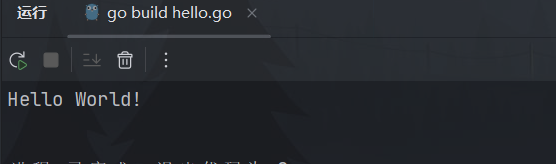

# 初学入门

出版书籍《Go微服务实战》的配套示例代码：[ScottAI/book: 书中示例 (github.com)](https://github.com/ScottAI/book)

## IDEA 创建项目

1. 打开 IDEA
2. 新建项目
3. 输入名称-另存为
4. 语言选择 go 【没有点击右边的 + 号】
5. idea 会自动读取环境变量，找到 go 开发环境


1. 首先创建一个空目录 helloworld
2. 创建 go 取名为 hello.go

```go
// main 包是核心入口【可执行程序】
package main

// 导包: fmt 是一个标准包
import "fmt"

// main() 入口函数
func main() {
  // 首字母大写: 包外可见【java 中非私有】
	fmt.Println("Hello World!")
}
```

3. 点击 ▶ 运行



<b style="color: red">注意: </b>

- 导入的包必须使用，否则编译不通过

- 声明的变量必须使用，否则编译不通过

## http 服务器

创建一个新的 go 文件

```go
package main

import (
	"fmt"
	"log"
	"net/http"
)

func handle(w http.ResponseWriter, r *http.Request) {
	s := "你好,开发者"
	_, err := fmt.Fprintf(w, "%s", s)
	if err != nil {
		log.Printf("出现错误! err: %s", err)
	}
	log.Printf("访问成功!s=%s", s)
}

func main() {
	fmt.Printf("服务启动...")
	// 当访问跟路径时,交给 handle 方法
	http.HandleFunc("/", handle)
	if err := http.ListenAndServe("localhost:8063", nil); err != nil {
		log.Fatal("http 启动失败:", err)
	}
}
```

在 IDEA 中运行


然后打卡浏览器，输入监听的地址：`http://127.0.0.1:8063/`


## 随机值的应用

```go
f := rand.Float64() * 100
fmt.Printf("随机值: %.2f", f)
```


