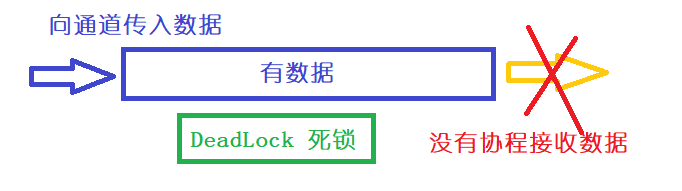
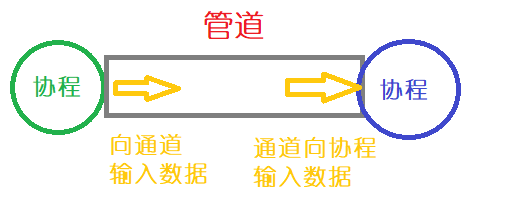

# Go 语言基础

## 程序基础

1. 了解常量和遍历【const var 关键词】

2. `:=` 初始化以及赋值

   ```go
   // 对变量 num 初始化,并赋值为 12
   // 之后想修改值不能用 := ,要用 =
   num := 12; 
   ```

3. for 循环关键字的使用【源码: ==ScoteAI-book/ch01/1.4/loop.go==】

4. 指针的使用 【源码: ==ScottAI-book/ch01/1.2/pointer/main.go==】

5. net/http 的使用 【源码: ==ScottAI-book/ch01/1.1/helloserver/main.go==】

6. 垃圾回收机制——三色标记法

   1. 白色集合：可能会被垃圾回收
   2. 黑色集合：保证存活
   3. 灰色集合：过渡用的

   

7. 包及作用域

   ```go
   // 调用其他包的变量
   package1.num1
   package2.num1
   ```


## 数据类型

1. 基本数据类型
   1. 整型
   2. 浮点型
   3. 复数
   4. 布尔类型
   5. 常量
   6. 字符串（可以看作复合数据类型）
2. 复合数据类型
   1. 结构体 （Struct）
   2. 数组

3. 引用数据类型
   1. 切片（slice）：切片是对数组的引用，它提供了动态大小、灵活的操作和便捷的切片操作。切片在Go语言中被广泛用于处理和操作数据集合。
   2. 映射（map）：映射是一种无序的键值对集合，也被称为字典或哈希表。它提供了快速的查找和检索操作，用于存储和管理键值对数据。
   3. 通道（channel）：通道是用于在Goroutine之间进行通信和同步的管道。它允许Goroutine之间发送和接收数据，并确保并发安全。
   4. 函数（function）：函数是一种引用类型，可以作为值传递给其他函数，也可以作为返回值。这使得在Go语言中可以灵活地使用函数来实现高阶函数和函数式编程的特性。

4. 接口数据类型
5. 格式化说明符
   1.  <span style="color: blue">%d</span> : 用于格式化整型
   2.  <span style="color: blue">%x|%X</span>：用于十六制数字
   3.  <span style="color: blue">%0d</span>：用于规定输出定长的整型
   4.  <span style="color: blue">%n.mg</span>：用户表示数字n，精确到小数点后 m 位。除了 g ，还有使用 e 和 f

> <span style="color: red">注意：</span>
>
> Go语言中的**指针（pointer）**也是一种==引用类型==，但它在语义上<span style="text-decoration: underline">更接近于基本类型</span>。指针可以用于间接引用和修改变量的内存地址，但与切片、映射和通道等引用类型有所不同。

<strong style="color: red"> 小提示：</strong> 引用类型引用传递，复合类型值传递！

|      类型      | 长度 | 默认值 |   说明   |
| :------------: | :--: | :----: | :------: |
|      bool      |  1   | false  |          |
|      byte      |  1   |   0    |  uint8   |
|      rune      |  4   |   0    |  uint32  |
|   int、uint    | 4或8 |   0    |  32或64  |
|  int8、uint8   |  1   |   0    |          |
| uint16、uint16 |  2   |   0    |          |
| int32、uint32  |  4   |   0    |          |
| int64、uint64  |  8   |   0    |          |
|    float32     |  4   |  0.0   |          |
|    float64     |  8   |  0.0   |          |
|   complex64    |  8   |        |          |
|   complex128   |  16  |        |          |
|    uSintptr    | 4或8 |        | 指针类型 |

## 字符串与复合数据类型

> <span style="color: red">注意：</span> Go 语言中没有对象和类的概念，封装思想都是通过复合类型来实现，比如结构体

1. 数组

   ```go
   // 初始化数组
   var a [3]int
   var b [3]int = [3]int{1,2,3}
   c := [...]int{1,2,3,4}
   // 新语法（记一下）index : value
   d := [...]int{4,4:1,1:2} // 等同于 [4 2 0 0 1]
   ```

2. 切片 (slice)：相当于 python 切片

   1. 创建切片：使用 make

      ```go
      s := make([]int,10)
      ```

   2. 如果要增加元素，建议采取 `append` 方法

   3. 如果要复制，采取 `copy` 方法【必须是切片，数组复制：`a[:]`】

   4. 多维切片可以通过嵌套切片来创建

      ```go
      // 创建一个二维切片
      matrix := [][]int{
        {1, 2, 3},
        {4, 5, 6},
        {7, 8, 9},
      }
      ```
    5. 在删除之前，将要删除元素置为 `nil` ，否则垃圾回收已删除元素，从而切片容量不会发生变化

3. map：相当于python中字典，或者Java中Map

   1. 创建 map ,使用 `make`

      ```go
      m := make(map[string] int)
      ```

   2.  使用其中元素

      ```go
      m := map[string] int {
        "k1": 11,
        "k2": 22
      }
      fmt.Println("k1: ", m["k1"])
      ```

   3.  删除其中元素：使用 `delete` 函数

      ```go
      delete(m, "k1")
      ```

4. 结构体（struct）

   1.  定义

      ```go
      type Person struct {
      	Name string
      	Gender,Age int
      }
      ```

   2.  同类型可以写在一行，并用 `,`号隔开

   3. 初始化结构体

      ```go
      // 初始值 nil
      var p *Person; 
      // 初始化结构体
      var pp = new(Person)
      pp.Name = "张三"
      // 初始化并赋值
      var p1 = Person{Name: "张三", Gender: 1, Age: 12}
      ```

   4. 封装性：属性名首字母大写（public），属性名首字母小写（private）

   5. 继承性：嵌套结构体（不可以是它自身，但可以有指针指向它自己）

      ```go
      // 父类 Person , 子类 Employee Student
      type Person struct {
      	Name string
      	Gender,Age int
      }
      
      type Employee struct {
      	p Person
      	Salary int
      }
      
      type Student struct {
      	Person
      	School string
      }
      
      // 赋值操作
      e := Employee{p:Person{"Scott",1,30},Salary:1000}
      var s Student
      s.Name = "Billy" 	//相当于 s.Person.Name = "Billy"
      s.Gender = 1			//相当于 s.Person.Gender = 1
      s.Age = 6					//相当于 s.Person.Age = 6
      s.School = "xxx 大学"
      ```

5. JSON（encoding/json、encoding/xml、encoding/asnl）

6. 字符串操作常用包：

   1. strings：提供搜索、比较、切分与字符串连接等
   2. bytes：如果要对字符串的底层字节进行操作，可以使用 `[]bytes`类型后进行处理
   3. strconv：主要是字符串与其他类型的转换，比如整数和布尔
   4. unicode：主要对字符串中单个字符进行判断，比如：IsLetter、IsDigit、IsUpper等

7. 对于参数传值

   1. 形参为数组时，应该考虑指针【因为数组默认采取值传递方式】
   2. 但是如果是切片，切片本质传递的是地址

8. make & new 函数对比说明

   1. make 主要用于切片、map和chan进行内存分配，返回不是指针，而是类型本身
   2. new 主要用于结构体，返回类型的指针


## 函数、方法、接口和反射

1. 函数

   1. 定义

   2. 闭包（保留外部函数的变量）

   3. 作用域

   4. 返回值（可多个）

   5. 变长参数（...）

   6. defer关键字：用于释放资源，按照后进先出规则（LIFO）

      ```go
      f,err := os.Open("filename")
      if err != nil {
        fmt.Println(err)
      }
      // 关闭资源
      defer f.Close()
      ```

2. 方法

   1. 定义

      ```go
      // 定义1个结构体
      type Rectangle struct {
        w,h float64
      }
      // 定义方法
      func (r Rectangle) area() float64 {
        return r.w * r.h
      }
      ```

3. 接口

   1. 定义

      ```go
      type ShapeDesc interface {
        Area() float64
        Perimeter() float64
      }
      ```

   2.  使用

      ```go
      // 前提：结构体需要重写 Area() 和 Perimeter 方法
      var s1,s2 ShapeDesc
      // 类型断言: x.(T),其中 x 相当于变量,T 相当于类型（此处是: type circle struct）
      _,ok := s1.(circle)
      ```

   3. 接口只能声明方法，没有实现

   4. 实现接口，必须实现接口内的所有方法（方法名、形参、返回值完全一致）

   5. 接口声明方法不可重名

   6. 接口可嵌套

4. 反射（reflect包）【源码: ==ScottAI-book/ch04/4.4/main.go==】

   1. reflect.ValueOf(&x) 获取结构体变量地址
   2. reflect.Elem() 获取地址中的值
   3. reflect.Type() 获取变量类型
   4. 还有更多用法在 reflect 包中
   5. <span style="color: red">**缺陷：**</span>反射可读性较差，性能相对于差，而且是运行时才报错

5. 总结

   1. 方法和函数很像，方法在方法名之前加上接收器参数（一般为结构体）
   2. 匿名函数和闭包用法要掌握
   3. 反射一般用于通用函数，一般是框架所做的事情，了解即可
   4. 了解前4部分，go 语言的基础部分已经结束
   5. go 语言优势在于多线程编程

## 并发编程（核心重点）

> 高性能编程 = 协程（goroutine）+ 通道 （channel）
>
> Go 语言将基于CSP（Communicating Sequential Process）模型的并发编程内置到语言中，即协程之间可以共享内存。

1. goroutine 协程： 一种轻量级的线程，使用 Go 语言关键字启动。

2. goroutine 和 系统线程是不一样的

3. 所有的 Go 语言都是通过 goroutine 运行的（包括 main 函数）

4. 核心概念：进程、线程、goroutine

   

5. 如何运行一个协程？**go 关键字**

   ```go
   func hello() {
     fmt.Println("Hello World!")
   }
   
   func main() {
     // 使用关键字启动协程
     go hello()
     // 加上延时
     // 主线程结束会关闭所有协程,从而导致不输出 Hello World
     time.Sleep(1*time.Second)
   }
   ```

6. sync.WaitGroup 去除休眠方式等待协程结束

7. 通道（channel）协程间的通信

   1. 初始值 nil

   2. 开启通道关键字 chan

   3. 关闭通道：close 函数

      ```go
      // 初始化
      c1 := make(chan int)
      // 将通道带入协程中
      go writeChan(c1, 666)
      // 接收通道数据
      a := <-c1
      
      // 协程中将值写入通道
      func writeChan(c chan int, x int) {
        // 写入通道该过程是阻塞的,必须有协程接收数据
        c <- x
        // 关闭通道
        close(c)
      }
      ```

   4. 通道方向：单向 & 双向（默认）

      ```go
      // 默认通道——双向
      func one(c chan int,x int) {
        // 向通道c写入数据x
        c <- x
      }
      
      // out 通道只写, in 通道只读
      // 箭头流向: 指向chan是写,指向变量是读
      func two(out chan<- int, in<-chan int) {
        // 读取 in 通道,赋值给 v
        for v:= range in {
          // 将数据 v 写入 out 通道
          out <- v
        }
      }
      ```

   5. 缓存通道【源码: ==ScottAI-book/ch05/5.2/buffer/main.go==】

      1. 在创建通道是可以指定队列最大长度

         ```go
         // 指定队列长度: 3
         c := make(chan int 3)
         ```

      2. 尾部插入元素，头部获取元素

      3. 队列空，接收数据的协程阻塞，等待另一个协程向该通道发送数据

   6. 切换通道 select （可以理解为 switch case）

      1. select 监听通道通信，有通信发生触发相应代码块

      2. 基本结构

         ```go
         select {
           case <- ch1:
           	fmt.Println("从通道1读取数据")
           case ch2 <- 1:
           	fmt.Println("向通道2写入数据")
           default:
           	fmt.Println("前面都不满足的情况")
         }
         ```

      3. 只能选择其中1个，都满足的情况会从中抽取1个

      4. 如果没有写 default，在没有向通道写入数据之前会阻塞

   7. select 超时问题解决【源码: ==ScottAI-book/ch05/5.2/timeout1/main.go==】

      

      1. 当某个协程向通道写入数据，没有协程接收时，将会死锁。【超时】

      2. 这时可以通过 select + time.After 去解决【检查】

      3. 如果可以通过随机数值代替具体数值

         ```go
         // 随机种子
         rand.Seed(time.Now().UnixNano)
         // 随机数
         no := rand.Intn(6)
         // 随机秒
         no *= 1000
         du := time.Duration(int32(no))*time.Millisecond
         ```

8. 管道（pipeline）【源码: ==ScottAI-book/ch05/5.3/main.go==】

   1. 概念：通道（channel）连接协程（goroutine），一个协程输出是另一个协程输入。

   

   2. 使用管道好处（3点）：

      1. 形成一个清晰的数据流，无需考虑协程和通道之间通信和状态问题
      2. 管道内不需要将数据保存为变量，节省空间
      3. 提高代码可维护度

9. 小结

   1. 协程（goroutine）
   2. 通道（channel）
   3. 管道（pipeline）
   

## 包和代码测试

前面总结：数据类型、函数、方法、接口、反射、协程、通道、管道。

编译快原因：

- 每个源文件显示声明导入包
- 避免循环引用，即有向无环
- 编译输出目标文件记录自己的导出信息，以及依赖包导出信息，在一个包内可以编译整个包的文件

1. 包（package）

   1. 对于导入的包必须使用（IDE自动管理，无需人工操作）

   2. 如果是包名冲突，必须起别名【当前文件有效】

      ```go
      import (
      	crand "crypto/rand"
        "math/rand"
      )
      ```

   3. 可以同python导入全部（import * from xxx）一样，可以简写成 .

      ```go
      import . "fmt"
      // 使用时, 无需 fmt.Println()
      Println("Hello World")
      ```

   4. 空导入，只需要其中的 init 函数，即只编译导入文件但不使用其中函数

      ```go
      import (
      	"database/sql"
        _ "github.com/go-sql-driver/mysql"
      )
      ```

   5. 包名的别名一般用复数形式，如 bytes、strings等

2. Go 工具（Go Tool）: 下载、查询、构建、格式化、测试、安装代码包

   1. 运行 `go help` 查看命令

   2. `GOPATH` 环境变量【重要】指定工作区间根目录，有3个子目录

      1. `src` 存放源文件
      2. `pkg` 存放编译后的包
      3. `bin` 存放可执行文件

   3. `GOROOT` 环境变量，默认采取Go语言安装目录

   4. `GOOS` 和 `GOARCH` 指定目标操作系统，指定目标处理器（如arm、amd64），交叉编译时会遇到

   5. 运行 `go env` 查看各个环境变量及对应的值【太多，掌握 GOPATH 即可】

   6. GO 命令

      1. `go get` 从互联网下载包

         ```go
         // 下载mysql 驱动包
         go get -u github.com/go-sql-driver/mysql
         ```

         go-get 包含了安装（go install）和编译（go build）两个步骤

      2. `go build` 编译指定源文件，多个源文件用空格隔开

      3. `go install` 编译源文件

      4. `go list` 查看包信息，查看完整信息：`go list -json fmt`

      5. `go doc` 打印输出文档信息

         ```go
         go doc fmt.Println
         ```

      6. `godoc` 生成体系化的 Web 页面

      7. `go run` 运行 go 文件

      8. `go test` 测试，一般以 *_test.go 命名【方便 go build 不编译这些文件】，如 one_test.go 文件

         ```go
         // one_test.go 
         package one
         // 测试文件必须引入该包
         import "testing"
         // 参数写 T
         func TestFun1(t *testing.T) {
           // 写测试代码...
           // t.Error("错误....")
         }
         ```

      9. 基准测试（Benchmark）

         ```go
         var final int
         func benchmarkFun1(b *testing.B) {
           var end int
           for i := 0; i < b.N; i++ {
             end = fun()
           }
           final = end
         }
         ```

3. 代码优化

   1. 分析代码标准库：runtime/pprof，生成性能分析报告
   2. 通过 `go tool pprof -help` 了解相关用法
   3. 常见问题
      1. CPU 占用率高，高负荷运转
      2. 线程（goroutine）死锁，占用资源
      3. 垃圾回收占用时间

4. 小结

   1. 包的命名
   2. 包的导入【冲突起别名】
   3. Go 命令
   4. 测试
   5. 性能分析：go tool pprof 和 benchmark
   6. godoc 文档
   7. Example 示例函数【go test 命令运用】

## 综合实战案例

基本类型、复合类型、函数、方法、接口、反射、协程、通道、管道，和包的管理，bug 定位，性能分析，对 *_test.go 文件的测试，使用 godoc 命令生成文档。基本上 Go 语言基础部分学完了。下一步进阶：竞态与并发、sync 包、context 包、工作池、Go Web 编程、net/http 包、Web 框架（如基于httprouter的gin框架、MVC框架Beego）、Web底层服务（TCPSocket、UDPSocket、WebSocket）、中间介、数据库访问（database/sql 接口）

## 框架部分

1.  gin: Web框架
2.  gorm: 数据库框架
3.  grpc: 远程调用
4.  etcd：目标是构建一个高可用的分布式键值(key-value)数据库
5.  go-micro：微服务框架

微服务框架（对比）：

| 框架      | 团队               | 开源时间 | 概述                                                         | 优势                                               | 缺点                                                         |
| --------- | ------------------ | -------- | ------------------------------------------------------------ | -------------------------------------------------- | ------------------------------------------------------------ |
| go-micro  | 国外大佬Asim团队   | 2015年   | 是最早，最经典的Go微服务框架之一                             | 轻量级框架，入门简单，文档清晰                     | 版本兼容性差，社区活跃度一般                                 |
| go-zero   | 国内大佬万俊峰团队 | 2020     | 提供了微服务框架需要具备的通用能力                           | 社区生态非常好，无论是文档更新还是技术群都很活跃   | 相比于go-micro比较重，同时也只带一部分的强约束，学习门槛比go-micro略高 |
| go-kit    | 国外大佬           | 2015     | Go-kit将自己描述为微服务的标准库。像Go一样，go-kit为您提供可用于构建应用程序的单独包。 | 极度轻量级框架                                     | 社区建设一般                                                 |
| tars-go   | 腾讯开源           | 2018     | tarsgo是tars这个大的C++重量级微服务框架下的go语言服务框架    | 优势在于很多能力不用从头开始做起，直接依托母体tars | 缺点是独立性较差，要选用这个tarsgo的前提，就是要先选用tars这个C++的框架 |
| dubbo-go  | 阿里开源           | 2019     | dubbogo是dubbo这个Java重量级微服务框架下的go语言服务框架     | 和腾讯开源项目类似                                 | 和腾讯开源项目类似                                           |
| go-kratos | B站开源            | 2019     | 轻量级的微服务框架，框架定位于解决微服务的核心诉求。         | 暂无，后续补充                                     | 暂无，后续补充                                               |
| jupiter   | 斗鱼开源           | 2020     | 面向服务治理的Golang微服务框架                               | 暂无，后续补充                                     | 暂无，后续补充                                               |


## 探索深度

1. 操作系统
2. 数据结构
3. 分布式一致性
4. 服务网络
5. Kubernetes & Docker
6. 协程（goroutine） 实现原理

---

go 的基本等级：

**初级**

初级呢，只要求掌握Golang的基本语法，懂几个流行的框架和库，能更删改查去做业务就行。一般我会问50%的golang知识点，一般集中在slice、map这块的；30%的数据库知识点，主要考察数据库的索引，事务的隔离，sql语句的优化之类的，也很基础；20%数据结构知识点，数据结构是编程的基础，这个怎么都逃不掉。一句话，能干活就行。

**中级**

中级呢，好歹也要知道一些底层的东西，或者是源码层的东西，什么goroutine的实现原理，什么内存逃逸，还有微服务相关的东西，另外docker和k8s也是必须要问的，主要考察知识的深度和广度，因为可能是小组的组长，要有一定的技术视野。

**高级**

高级呢，偏于项目管理和技术选型，golang应该也没有多少问的，但是也要问一两个golang设计哲学性的问题，比如对泛型怎么看之类的，主要还是对于系统架构和项目的管理的理解，顺便聊聊他之前做过的项目怎么管理，用了哪些技术选型，考量是什么，为什么最后选择了这个放弃了那个，然后碰到过什么坑，是怎么解决的。

