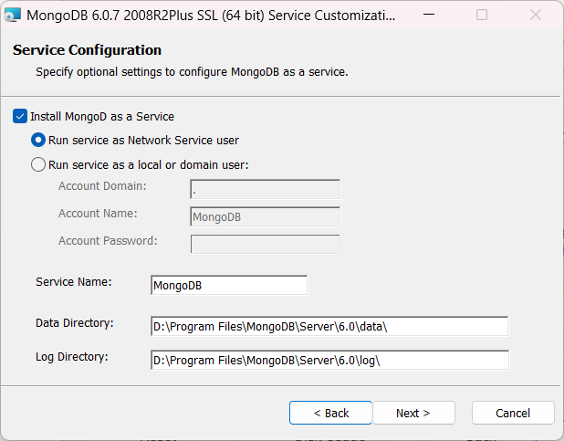
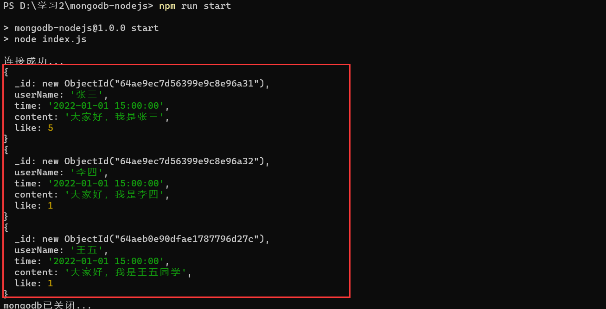
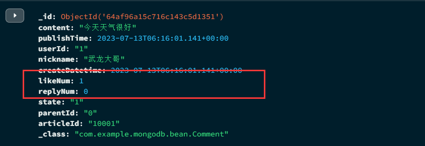

# 安装数据库

1. 下载

下载地址：[Download MongoDB Community Server | MongoDB](https://www.mongodb.com/try/download/community)


根据提示选择不同的版本、平台以及安装形式，在这里采取 即可。

点击绿色按钮 Download 即可下载。

文件较大，请耐心等待...

> 安装包信息：
>
> 文件大小： 482.433MB
>
> 下载耗时：5~8分钟（根据自己的情况而定）

2. 安装

双击下载的文件：mongodb-windows-x86_64-6.0.7-signed.msi


选择自定义安装。


选择  ，建议。



默认即可，数据目录（Data Directory）和日志目录（Log Directory）记住。

剩下的，全部下一步（Next > ）即可。


等待安装完毕！安装完后，会自动弹出 Compass (一个可视化数据库管理页面)。

# 基本命令

## 数据库的创建

切换数据库（如果没有，会在内存中创建一个新的数据库）

```shell
use fly_articleDb;
```

使用 db 查看当前数据库

```shell
db
```

删除当前数据库

```shell
db.dropDatabase();
```

## 集合的相关操作

> Collection 在数据库中的集合，里面可以有多条记录（Json数据）

可以等同于 Mysql 中的数据表。



通常我们一般隐式创建，我们不需要关注集合是如何创建的。



创建一个集合

```shell
db.createCollection("test")
```

查看当前数据库下的集合

```shell
show collections
```

删除集合（这里以  为例）,这里的 test 应该换成响应的集合名称。

```shell
db.test.drop();
```

## 文档的相关操作

> 都是以 JSON 为主。集合名可以存在，也可以不存在（隐式创建）。

增加数据。

```shell
db.集合名.insertOne(传入json数据)
```

查找数据

```shell
db.集合名.find()
db.集合名.findOne(); # 只查询一条记录
db.集合名.find(传入json数据进行筛选)
db.集合名.find(传入json数据, {字段: 1, 字段: 0}) # 其中1表示显示,0表示隐藏
```

插入多条数据

```shell
db.集合名.insertMany(传入json数据) # 其中传入的 json 数据，以 [] 开头和结尾
```

修改数据。其中 $set 还有 $inc 等...

对于要将字符串转变成数字，可以采取  进行包裹。

```shell
db.集合名.updateOne({查询条件}, {$set: {修改数据部分}})
```

其余方法可以尝试：

- updateMany
- updateOne
- updateSearchIndex

删除数据

```shell
db.集合名.remove(查询条件)
```

删除所有数据

```shell
db.集合名.remove({})
```

## 文档的分页查询

查询总个数

```shell
db.集合名.countDocuments()
```

分页查询：limit 和 skip

- limit 限制查询条数，等同于每页显示多少条
- skip 跳过前面条数

```shell
db.集合名.find().limit(数字)
db.集合名.find().limit(数字).skip(数字)
```

排序：sort，根据传入的字段决定是升序（1）还是倒序（-1）

```shell
db.集合.find().sort({传入json数据})
```

## 文档的其他查询

正则查询。

基本格式如下：

```shell
db.集合名.find({字段: /正则表达式/})
```

查询的其他方式：

- $gt 大于
- $lt 小于
- $gte 大于等于
- $lte 小于等于
- $ne 不等于
- $in 包含查询，等同于 mysql 的 in 查询

```shell
db.集合名.find({userId: {$in: [1,2]}})
```

- $nin 不包含查询
- $and 并列运算

```shell
db.集合名.find({$and: [{}, {}]})
```

- $or 或运算，和 $and 类似

# 索引

索引有 单索引、复合索引以及其他索引。

查看索引

```shell
db.集合名.getIndexes()
```

创建索引

```shell
db.集合名.createIndex({字段: 1}) # 1 表示升序 , -1 表示降序
```

删除索引

```shell
db.集合名.dropIndex(索引名称)
```

删除所有索引

```shell
db.集合名.dropIndexes()
```

# NodeJs 操作 Mongodb 

安装 npm 包

```shell
npm i mongodb
```

基本模板，操作 mongodb。一般情况下都是异步获取

```js
const MongoClient = require('mongodb').MongoClient;
// 数据库可以更改
const db_name = "fly_articleDb";
const url = 'mongodb://127.0.0.1:27017';

(async function () {
    const client = new MongoClient(url);

    try {
        // 1. 连接 mongodb 数据库
        await client.connect();
        console.log("连接成功...");
        // 2. 使用数据库fly_articleDb
        const db = client.db(db_name);
        // 3. 通过数据库得到相应的集合test【这里也可以操作自己的集合】
        const test = db.collection("test");
        // 4. 查询 test 集合中的文档【这里只是查询，其他方法跟mongodb类似】
        const test_list = test.find();
        // 判断是否有文档
        while (await test_list.hasNext()) {
            // 获取该条数据
            const currentData = await test_list.next();
            console.log(currentData);
        }
    } catch (e) {
        console.log(e);
    }
    await client.close();
    console.log("mongodb已关闭...");
})();
```



# SpringBoot 操作 mongodb

创建 springboot ，并且添加依赖。

```xml
<dependency>
  <groupId>org.springframework.boot</groupId>
  <artifactId>spring-boot-starter-data-mongodb</artifactId>
</dependency>
```

配置文件 application.yml

```yaml
spring:
  data:
    mongodb:
      host: 127.0.0.1
      database: fly_articleDb
      port: 27017
      # 可以采取 mysql 写法
      # uri: mongodb://127.0.0.1/fly_articleDb
```

运行 SpringBoot ，查看是否连接成功。

连接成功后，SpringBoot 日志会显示下面红线部分，成功连接 mongodb。


## 创建实体类

bean 包下创建 Comment 类

```java
@Data
// comment 集合（类名相同时,可以省略）
@Document(collection = "comment")
// 复合索引
//@CompoundIndex(def = "{'userId': 1, 'nickname': -1}")
public class Comment {
    // @Id // 可以省略,当变量名为 id
    private String id;
    // @Field("content") 变量名相同时可以省略
    // 评论内容
    private String content;
    // 发布时间
    private Date publishTime;
    // 添加单字段索引
    // 发布人id
    @Indexed
    private String userId;
    // 昵称
    private String nickname;
    // 评论的日期时间
    private LocalDateTime createDatetime;
    // 点赞数
    private Integer likeNum;
    // 回复数
    private Integer replyNum;
    // 状态
    private String state;
    // 上级id: 具体回复那个用户
    private String parentId;
    // 文章id
    private String articleId;
}
```

DAO 接口

```java
public interface CommentRepository extends MongoRepository<Comment, String> {
}
```

然后写 Service 层和 Controller 层，具体的调用方法和 Mysql 类似。本文不再阐述。

## 测试

查询所有评论

```java
@Test
public void find() {
  List<Comment> comments = commentService.findComments();
  System.out.println(comments);
}
```


## 点赞功能

类似于 mongodb 的 $inc，需要借助 `MongoTemplate`

```java
@Autowired
private MongoTemplate mongoTemplate;

/**
 * 更新点赞
 */
public void updateLikeNum(String id) {
  Query query = Query.query(Criteria.where("_id").is(id));
  Update update = new Update();
  update.inc("likeNum");
  mongoTemplate.updateFirst(query,update,Comment.class);
}
```

更新前：



更新后：


