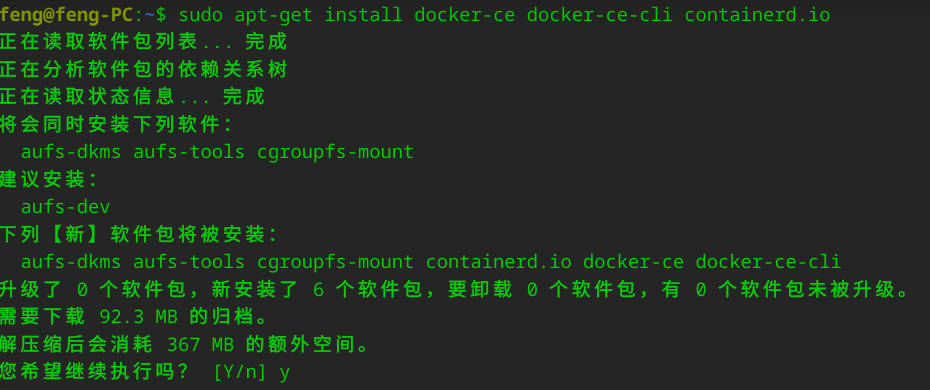
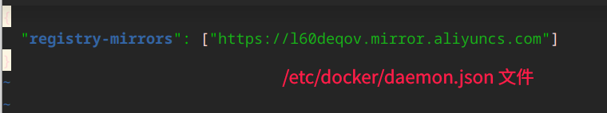

# docker

首先卸载掉旧版本

```sh
sudo apt-get remove docker docker-engine docker.io containerd runc
```

## 下载

参考文章：http://www.taodudu.cc/news/show-5875688.html?action=onClick

### 添加仓库

文件: `/etc/apt/sources.list`

通过 vim 打开文件，并在最后添加源

```sh
sudo vim /etc/apt/sources.list
```


### 安装

```sh
sudo apt-get install docker-ce docker-ce-cli containerd.io
```



等待安装完毕...(耗时46秒)

### 启动 docker

```sh
systemctl start docker
```

会提示输入密码，deepin 也可以人脸识别。

### 查看 docker 版本

```sh
docker --version
```


docker-ce 查看

```sh
docker version
```


### 切换国内加速器

这里采取阿里云加速地址: https://cr.console.aliyun.com/cn-hangzhou/instances/mirrors

 

details 配置文件说明



1. 当你下载安装的Docker Version不低于1.10时，建议直接通过daemon config进行配置。
2. 使用配置文件 <span style="background-color: yellow">/etc/docker/daemon.json</span>（没有时新建该文件）
    ```json
    {
        "registry-mirrors": ["<your accelerate address>"]
    }
    ```
3. 重启 Docker Daemon

 

具体操作如下：



需要管理员权限：sudo 

```sh
sudo vim /etc/docker/daemon.json
```



重新启动 docker

```sh
sudo systemctl daemon-reload
```

```sh
sudo systemctl restart docker
```


