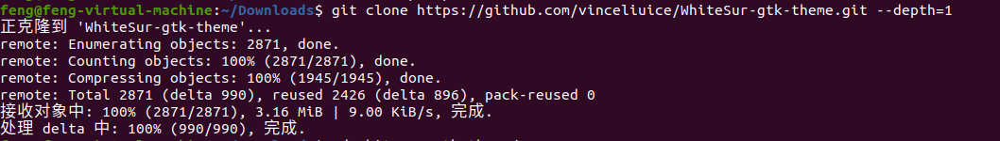
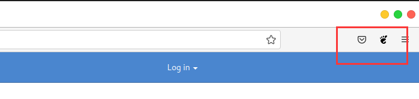

各个标题无先后顺序，但要求按照步骤来，怕出现错误。

GNOME官方插件中心：https://extensions.gnome.org/ 安装插件 

# Ubuntu 美化桌面

1. Git 克隆

```sh
git clone https://github.com/vinceliuice/WhiteSur-gtk-theme.git --depth=1
```


2. 安装

```sh
cd WhiteSur-gtk-theme/ && ./install.sh
```


3. 更多自定义安装

```sh
./install.sh --help
```

# 安装 GNOME Tweaks 工具和 gnome 扩展

GNOME Tweaks 工具是必须的，我们需要它来更改主题和图标，GNOME Tweaks 工具可以在Ubuntu的软件商店找到，也可以通过以下命令安装：

```sh
sudo apt-get install gnome-tweak-tool
```

为了更加的可自定义性，还需要去安装一下扩展：

```sh
sudo apt-get install gnome-shell-extensions
```

这里还要执行以下命令：

```sh
sudo apt-get install chrome-gnome-shell 
```

打开 GNOME Tweaks 工具


设置应用程序


# GNOME 插件


点击安装 浏览器插件，浏览器上方会出现插件图标



# dock 栏设置

“Dash to Dock” 是一个 GNOME 扩展。只需要通过浏览器安装即可，安装之后打开右键“show applications” 按钮（最下边的菜单按钮）并选择 “Dash to dock settings” 来更改设置。

1. 搜索 Dash to Dock


2. 点击安装


3. Dash to Dock 设置

右键点击应用程序，如下图。


