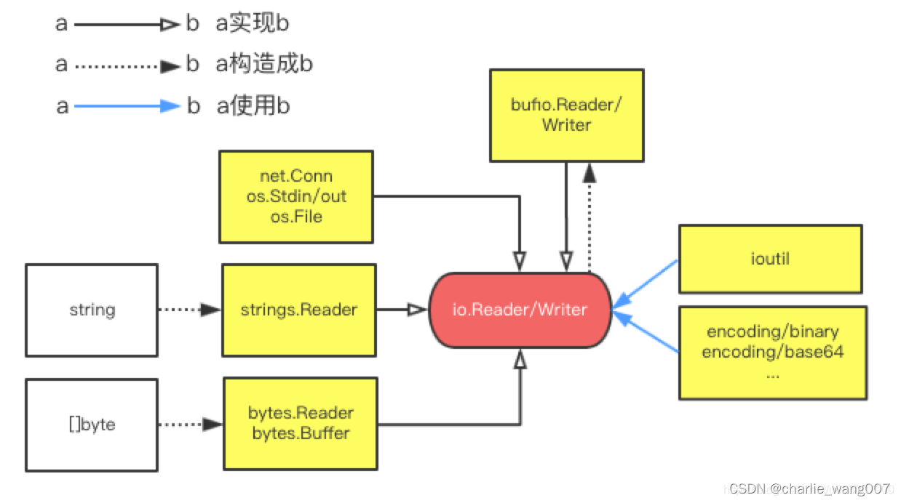

# 基础概念

包io为I/O基元提供了基本接口。它的主要工作是将此类原语的现有实现（如包操作系统中的实现）封装到抽象功能的共享公共接口中，以及一些其他相关原语。 因为这些接口和基元使用各种实现来封装较低级别的操作，除非另有通知，否则客户端不应认为它们对于并行执行是安全的。

```go
type Reader interface {
	Read(p []byte) (n int, err error)
}

type Writer interface {
	Write(p []byte) (n int, err error)
}
```




# 常用实现

1. 网络、标准输入输出、文件流读取
   1. net.Conn
   2. os.Stdin
   3. os.File
2. 把字符串抽象成 Reader
   - strings.Reader
3. 把[]byte抽象成Reader
   - bytes.Reader
4. 把[]byte抽象成Reader和Writer
   - bytes.Buffer
5. 抽象成带缓冲的流读取
   - bufio.Reader/Writer

# bufio 介绍

bufio 在程序和系统之间，添加了一个缓冲区。


# 实操部分

参考链接：[golang io.Reader和io.Writer_golang io.writer](https://blog.csdn.net/weixin_41479678/article/details/125007295)

官方文档：[golang io部分](https://pkg.go.dev/io)



程序已通过，开发环境如下:

- IDEA 2023.1
- go go version go1.20.4 windows/amd64



```go
package test

import (
	"bytes"
	"log"
	"testing"
)

const s = "SEND fly"

func TestSend(t *testing.T) {
	reader := bytes.NewBufferString(s)
	res, err := reader.ReadBytes(' ')
	if err != nil {
		log.Printf("出现错误!%s", err)
	} else {
		log.Printf(string(res))
	}
}
```

运行结果：


