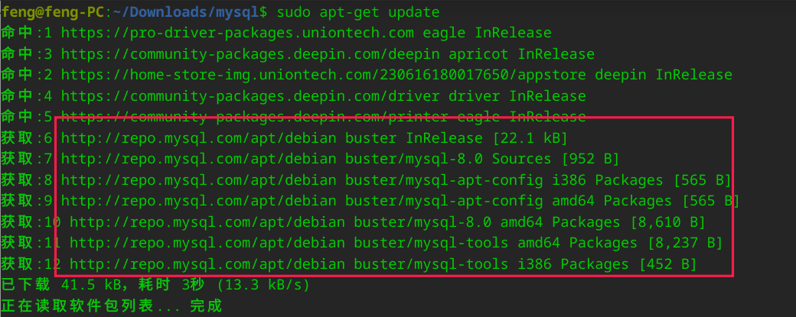
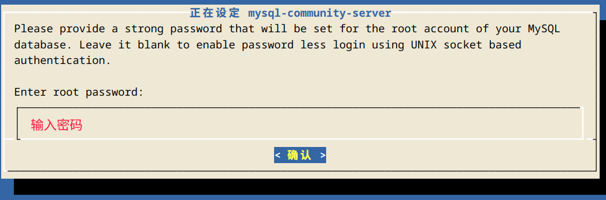
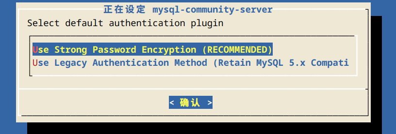

## 下载

### 从网上下载

https://dev.mysql.com/get/mysql-apt-config_0.8.23-1_all.deb

### 安装 mysql-apt-config

下载文件名: `mysql-apt-config_0.8.23-1_all.deb`

终端打开安装

```bash
sudo dpkg -i mysql-apt-config_0.8.23-1_all.deb
```

安装时：必须选择 `debian buster`


选择确认后，然后选择 OK


### 更新 apt-get

```sh
sudo apt-get update
```



从图中我们可以看到已经加入了 mysql 镜像源

### 接着直接安装 mysql



如果你在安装 mysql 时没有遇到没有软件包mysql这个错误，你可以不用管前面3个步骤。


```bash
sudo apt-get install mysql-server mysql-client
```

输入密码，按确认



如果碰到这个，直接确认



这时候需要漫长的等待...

查看版本：

```bash
#mysql  Ver 8.0.33 for Linux on x86_64 (MySQL Community Server - GPL)
mysql --version
```

## 查看 mysql 状态

### 查看状态

```bash
sudo service mysql status
```


### 停止

```bash
sudo service mysql stop
```

### 启动

```bash
sudo service mysql start
```

## 卸载

```bash
# 卸载mysql：
sudo apt-get autoremove mysql* --purge
sudo apt-get remove mysql-server
sudo apt-get remove mysql-common

# 清理残留数据 
sudo dpkg -l |grep mysql|awk '{print $2}' |sudo xargs dpkg -P 
sudo rm -rf /etc/mysql/ 
sudo rm -rf /var/lib/mysql

# 检查是否删除完毕
whereis mysql
sudo find / -name mysql
```