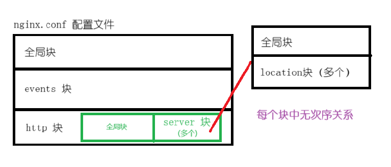



参考文章：

1. [Nginx配置文件详解 - 程序员自由之路 - 博客园 (cnblogs.com)](https://www.cnblogs.com/54chensongxia/p/12938929.html)
2. [Nginx快速入门-KuangStudy-文章](https://www.kuangstudy.com/bbs/1353634800149213186)



# 三层架构

三层结构：（具体以下图为例）

- 全局块
- event 块
- http 块
  - http 全局块
  - 多个 server 块
    - server 全局块
    - 多个 location 块



基本配置如下：

```nginx
worker_processes  1;

#...

events {
    worker_connections  1024;
}


http {
  
  #...
  
  # 可以包含多个服务
  server {
    
    #...
    
    listen 80; # 监听80端口
    server_name localhost; # 监听主机地址
    
    # 可以包含多个地址
    localtion / {
      root html;
      index index.html index.htm;
    }
  }
}
```

# Listen

server块中最重要的指令就是listen指令，这个指令有三种配置语法。这个指令默认的配置值是：`listen *:80 | *:8000；`只能在server块种配置这个指令。

1. 监听某个ip地址
2. 监听某个端口（）
3. 其他（无需多加关注）

```nginx
//第一种
listen address[:port] [default_server] [ssl] [http2 | spdy] [proxy_protocol] [setfib=number] [fastopen=number] [backlog=number] [rcvbuf=size] [sndbuf=size] [accept_filter=filter] [deferred] [bind] [ipv6only=on|off] [reuseport] [so_keepalive=on|off|[keepidle]:[keepintvl]:[keepcnt]];

//第二种 
listen port [default_server] [ssl] [http2 | spdy] [proxy_protocol] [setfib=number] [fastopen=number] [backlog=number] [rcvbuf=size] [sndbuf=size] [accept_filter=filter] [deferred] [bind] [ipv6only=on|off] [reuseport] [so_keepalive=on|off|[keepidle]:[keepintvl]:[keepcnt]];

//第三种（可以不用重点关注）
listen unix:path [default_server] [ssl] [http2 | spdy] [proxy_protocol] [backlog=number] [rcvbuf=size] [sndbuf=size] [accept_filter=filter] [deferred] [bind] [so_keepalive=on|off|[keepidle]:[keepintvl]:[keepcnt]];
```

> 拓展：可以简单了解server_name，它可以准确匹配、通配符（前后）以及正则匹配。

# location

在 nginx 官方定义：

```nginx
location [ = | ~ | ~* | ^~ ] uri { ... }
```

小技巧：可以将 nginx 的 location 想象成 `window.location` 去除 `host` 的部分。

