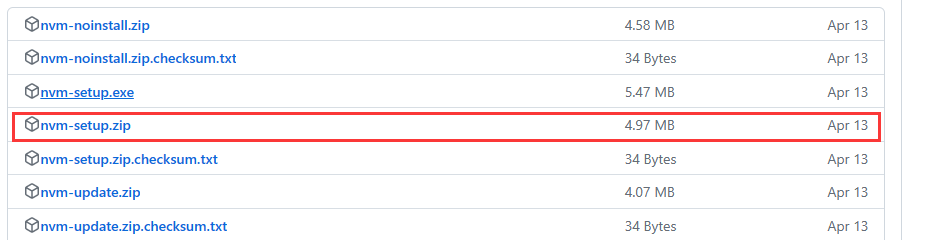

# nodejs 更新

1. 查看版本

```sh
node -v
```


2. 清除npm缓存

```sh
npm cache verify
```


3. 安装 nvm 

> 专门用来管理版本

下载地址：[Releases · coreybutler/nvm-windows (github.com)](https://github.com/coreybutler/nvm-windows/releases)



下载 nvm-setup.zip 文件，接着直接下一步...

安装成功后，输入命令

```sh
nvm --version
```


4. 安装新版 nodejs

```sh
nvm install lts
```


5. 切换nodejs

```sh
nvm use 18.16.0
```

