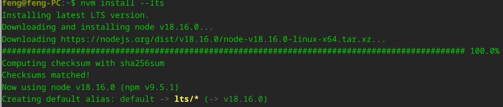
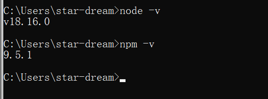

# nvm

## Linux 下载

Deepin 开启系统代理，开启 Qv2ray

```bash
wget -qO- https://raw.githubusercontent.com/nvm-sh/nvm/v0.39.3/install.sh | bash
```

下载后，自动添加到环境变量。

环境变量位置：`~\.bashrc`

安装目录：`~\.config\nvm`

## 使用

新打开一个终端

查看版本：

```bash
nvm --version
```

安装 lts 版本：

```bash
nvm install --lts
```



查看当前使用的 node

```bash
nvm current
```

---

## Windows 卸载



首先卸载 nodejs

- 控制面板删除
- 环境变量删除
- 安装目录删除（`where node`）
- 家目录有关 nodejs 删除
- %AppData% 文件夹里面 nodejs 删除

先去 github 下载 nvm

双击可执行文件 nvm-setup.exe



## Windows 下载

1. 打开 nvm 安装目录


打开 settings.txt 文件，加入以下信息：

```txt
root: D:\software\nvm-1.1.11
path: D:\Program Files\nodejs
node_mirror: https://npmmirror.com/mirrors/node/
npm_mirror: https://registry.npmmirror.com/binary.html?path=npm/
```

在  安装 nodejs

```cmd
nvm install lts
```

在 cmd 中使用 nodejs

```cmd
nvm use ${版本号}
```

查看版本，是否安装完成


