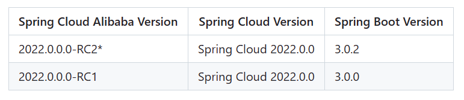
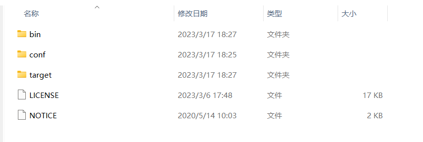

# 概要

SpringCloud Alibaba是SpringCloud的子项目，SpringCloud Alibaba符合SpringCloud标准。

具体大纲9大步：服务发现、负载均衡、模块通信、服务容错、消息驱动、网关、用户认证和授权、配置管理、调用链监控。



Spring Cloud Alibaba 五大组件：

1. Sentinel
2. Nacos 注册中心、配置中心、服务管理（UI可视化）
3. RocketMQ
4. Dubbo
5. Seata



1. 服务发现 Nacos

   - 服务发现原理剖析

   - Nacos Server/Clinet

   - 高可用Nacos搭建


2. 负载均衡Ribbon

   - 负载均衡常见模式

   - RestTemplate整合Ribbon

   - Ribbon配置自定义

   - 如何扩展Ribbon


3. 声明式HTTP客户端-Feign

	- 如何使用Fegin
	- Fegin配置自定义
	- 如何扩展Fegin

4. 服务容错Sentinel

	- 服务容错原理
	- Sentinel
	- Sentinel Dashboard
	- Sentinel核心原理分析

5. 消息驱动RocketMQ

	- SpringCloud Stream
	- 实现异步消息推送与消费

6. API网关GateWay

	- 整合GateWay
	- 三个核心
	- 聚合微服务请求

7. 用户认证与授权

	- 认证授权常见方案
	- 改造GateWay
	- 扩展Fegin

8. 配置管理Nacos

	- 配置如何管理
	- 配置动态刷新
	- 配置管理的最佳实现

9. 调用链监控Sleuth

	- 调用链监控剖析
	- Sleuth使用
	- Zipkin使用


# 环境搭建

版本说明可以参考下面网址：（Spring Cloud 和 Spring Boot 强相关）

[版本说明 · alibaba/spring-cloud-alibaba Wiki · GitHub](https://github.com/alibaba/spring-cloud-alibaba/wiki/版本说明)



根据版本信息，环境选择：

- Spring Cloud Alibaba 
- Spring Cloud  
- Spring Boot  

```xml
<properties>
  <alibaba-version>2022.0.0.0-RC2</alibaba-version>
  <spring-cloud.version>2022.0.0</spring-cloud.version>
</properties>

<!-- 继承 -->
<dependencyManagement>
  <dependencies>
    <!-- spring cloud alibaba-->
    <dependency>
      <groupId>com.alibaba.cloud</groupId>
      <artifactId>spring-cloud-alibaba-dependencies</artifactId>
      <version>${alibaba-version}</version>
      <type>pom</type>
      <scope>import</scope>
    </dependency>
    <!-- Spring Cloud -->
    <dependency>
      <groupId>org.springframework.cloud</groupId>
      <artifactId>spring-cloud-dependencies</artifactId>
      <version>${spring-cloud.version}</version>
      <type>pom</type>
      <scope>import</scope>
    </dependency>
  </dependencies>
</dependencyManagement>
```

# Nacos

Nacos：注册中心、配置中心、服务管理（可视化界面）

关键特性：

- 服务发现和服务健康监测
- 动态配置服务
- 动态 DNS 服务
- 服务及其元数据管理

## 下载

下载地址：https://github.com/alibaba/nacos/releases

下载的版本要根据 `Spring Cloud Alibaba` 组件版本关系。


之前选择的 Spring Cloud Alibaba ，现在我们应该要下载 Nacos  


下载需要等待一会儿时间~

下载下来，解压缩”安装包“，解压后得到如下目录：



## 启动服务器

参考文档：[Nacos 快速开始](https://nacos.io/zh-cn/docs/v2/quickstart/quick-start.html)

### 单机模式

打开 `bin` 目录下面的 startup.cmd 文件，通过编辑方式打开（可以拖到 VSCode 中）。


修改模式为 。



模式可以选择2种模式：

1. cluster 集群模式
2. standalone 单机模式



模式修改完成后，记得保存。

### 配置文件

> 在2.2.0.1和2.2.1版本时，必须执行此变更，否则无法启动；其他版本为建议设置。

修改`conf`目录下的`application.properties`文件。

设置其中的`nacos.core.auth.plugin.nacos.token.secret.key`值，详情可查看[鉴权-自定义密钥](https://nacos.io/zh-cn/docs/v2/plugin/auth-plugin.html).



注意，文档中的默认值`SecretKey012345678901234567890123456789012345678901234567890123456789`和`VGhpc0lzTXlDdXN0b21TZWNyZXRLZXkwMTIzNDU2Nzg=`为公开默认值，可用于临时测试，实际使用时请**务必**更换为自定义的其他有效值。



将密钥添加到下图黄圈处：


最后双击 `startup.cmd` 文件。

显示下方文字表示启动成功：

> 2023-07-21 21:40:55,435 INFO Nacos started successfully in stand alone mode. use embedded storage

现在访问 Nacos 网址。


访问：`http://192.168.169.1:8848/nacos/index.html` 即可进入登录页面。



账号：nacos

密码：nacos



关闭服务器双击运行文件。

## 服务注册发现

在模块的 pom.xml 文件中添加下面依赖：

```xml
<dependencies>
  <dependency>
    <groupId>com.alibaba.cloud</groupId>
    <artifactId>spring-cloud-starter-alibaba-nacos-discovery</artifactId>
  </dependency>
</dependencies>
```

然后添加配置（在`application.yml` 文件）

```yaml
server:
  port: 8083
spring:
  application:
  	# 模块起名
    name: test4-nacos
  cloud:
    nacos:
      discovery:
      	# nacos 访问地址
        server-addr: 127.0.0.1:8848
        # nacos 用户名
        username: nacos
        # nacos 密码
        password: nacos
        # nacos 命名空间: 可以区分开发环境和生产环境
        namespace: public
```

启动该模块，在 nacos 界面上的`服务管理 > 服务列表` 可以看到开启的服务。


通过调用服务名的方式去调用其他接口：

```java
@GetMapping("/hello")
public String hello() {
  log.info("[test3 模块] 请求接口:/user/hello");
  return restTemplate.getForObject("http://test4-nacos/fruit/hello", String.class);
}
```

其中 `test4-nacos` 是其他模块的名称。

但只是这样是不够的，还需添加一个注解 `@LoadBalanced`

对于的 Spring Cloud，会报错 <span style="background-color: #b71c1c;color: #fff;padding: 2px 4px;border-radius: 3px;"> java.net.UnknownHostException: test4-nacos </span>



解决办法：

因为Netflix的组件从2020年开始停止维护，因此spring cloud会逐渐弃用他家的组件,Ribbon就在其中，可以搜一个github里面spring-cloud-alibaba的issues。

1. 使用spring-cloud-loadbalancer代替ribbon，在项目中引用依赖

```xml
<dependency>
  <groupId>org.springframework.cloud</groupId>
  <artifactId>spring-cloud-starter-loadbalancer</artifactId>
</dependency>
```

2. 降低 Spring Cloud 版本，最好是选择 2020 以前的版本



## 基础配置

一些配置默认即可，通常不需要在 `application.yml` 文件中修改。

- server-addr 默认本机的8848端口
- username 默认 nacos
- password 默认 nacos
- namespace 默认 public，区分不同项目、不同环境
- ephemeral 默认 true，临时实例，服务停止时在一定时间后会进行删除
- service 默认`${spring.application.name}`
- group 跟命名空间一样，只是更细地划分
- weight 默认 1， 权重
- metadata 元数据，可以做扩展

这些配置了解即可，因为可以通过可视化界面进行修改。

# 负载均衡器 Ribbon



了解即可，高版本已弃用 Ribbon。

建议选择 <span style="background-color: #0091ea;color: #fff;padding: 2px 4px;border-radius: 3px;"> loadbalancer </span>



通过选择不同的服务实例，调用不同的服务。

它们都继承 

- RandomRule 随机
- RoundRobinRule 轮询
- RetryRule 轮询基础上重试
- WeightedResponseTimeRule 权重，根据每个实例运行时间去计算各自的权重
- ClientConfigEnableRoundRobinRule
- BestAvailableRule 过滤失效服务，挑选并发最小
- ZooeAvoidanceRule 【默认】
- AvailabilityFilteringRule

# 负载均衡器 LoadBalancer



推荐使用



添加依赖：

```xml
<dependency>
  <groupId>org.springframework.cloud</groupId>
  <artifactId>spring-cloud-starter-loadbalancer</artifactId>
</dependency>
```

一些常用规则：RoundRobinLoadBalancer

可以仿照 `RoundRobinLoadBalancer` 写自定义规则。

添加配置官方文档：[Cloud Native Applications (spring.io)](https://docs.spring.io/spring-cloud-commons/docs/4.0.3/reference/html/#spring-cloud-loadbalancer)

规则写在扫描区域外部。

# OpenFeign

OpenFeign是一个显示声明式的WebService客户端。模块之间相互调用的工具。

## 快速使用

1. 加入依赖

```xml
<!-- OpenFeign -->
<dependency>
  <groupId>org.springframework.cloud</groupId>
  <artifactId>spring-cloud-starter-openfeign</artifactId>
</dependency>
```

2. 写调用其他模块接口

创建一个 feign 包，然后再创建一个接口 `FruitFeign` 

```java
@FeignClient(name = "test4-nacos", path = "/fruit")
public interface FruitFeign {
    @GetMapping("/hello")
    String hello();
}
```

@FeignClient 注解：

- name 表示要调用哪一个服务（模块）
- path 就是要访问的接口地址

3. 调用前面的feign接口

将 feign 层和 service 层作比较，前者是其他模块的接口，后者(service)是处于当前模块。

```java
@Autowired
private FruitFeign fruitFeign;

@GetMapping("/hello")
public String hello() {
  // 像调用 service 层一样简单
  String msg = fruitFeign.hello();
  return "模块5:" + msg;
}
```

4. 加上注解 @EnableFeignClients

如果没有这一步，提示 <span style="background-color: #b71c1c;color: #fff;padding: 2px 4px;border-radius: 3px;">无法自动装配。找不到 'FruitFeign' 类型的 Bean</span>

```java
@SpringBootApplication
// 启用 feign
@EnableFeignClients
public class Test5Application {
	// main 方法
}
```

