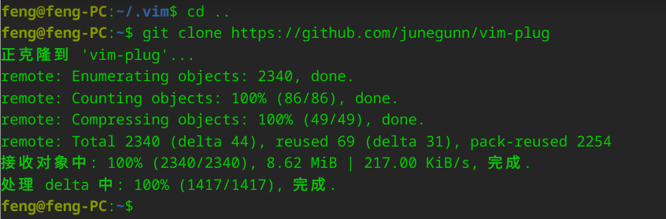

# vim-plug 下载

参考网址：https://blog.csdn.net/m0_48432283/article/details/123950518

## 1. 克隆

回到家目录： `cd ~`

```bash
git clone https://github.com/junegunn/vim-plug
```

等待安装完毕...




## 2. 移动到 vim 

创建目录

```bash
mkdir -p .vim/autoload
```

将 `plug.vim` 复制到新目录下

```bash
cp ./vim-plug/plug.vim .vim/autoload/plug.vim
```

# 插件使用

## 1. 搜索插件

网址：https://vimawesome.com/


## 2. 安装插件

编辑: `~/.vimrc` 文件

```vim
call plug#begin('~/.vim/plugged')
Plug '插件名称'
call plug#end()
```


## 3. 插件安装

先保存

```vim
:w
```

运行命令重新加载 `.vimrc` 文件

```vim
:source %
```

安装插件

```vim
:PlugInstall
```

## 4. 插件卸载

```vim
:PlugClean
```


