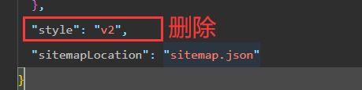
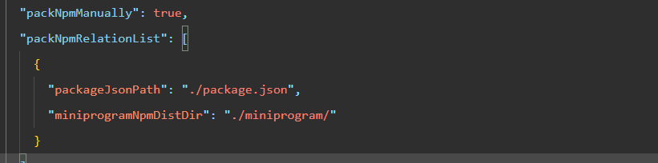
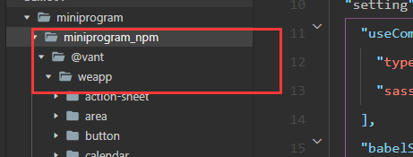
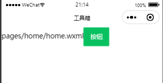

# 起步



熟悉小程序的创建方式，可以跳过 <b> 起步 </b> 部分



根据自己情况选择，不同的模板。

1. 目录自定义
2. AppID：选择你自己的
3. 选择 <span style="background-color: yellow">不使用云服务</span> （对初学者友好，没有太多文件）
4. 根据需要选中<span style="background-color: #64b5f6"> TS + Scss 模板 </span>


选择你自己的 UI 组件库（或者原生写小程序，不采取第三方UI）

# UI 组件库的选择

> 优先采取 Vant Weapps （如果不用组件库，可跳过）
>
> 官网：[前往 Vant 组件库](https://vant-contrib.gitee.io/vant-weapp/#/quickstart)

- 安装 npm 包

```powershell
yarn add @vant/weapp --production
```

- 删除新版小程序样式

`app.json` 文件中删除 "style": "v2"



- 手动索引到正确的 npm 依赖位置

```json
{
  //其他信息...
  "setting": {
    //其他配置...
    "packNpmManually": true,
    "packNpmRelationList": [
      {
        "packageJsonPath": "./package.json",
        "miniprogramNpmDistDir": "./miniprogram/"
      }
    ]
  }
}
```



- 构建 npm



这一步至关重要，需要从远程安装包。



具体步骤：选中“工具”-“构建npm”,等待构建完成


构建完成，应该能够看到已经成功下载 vant 



# 开始使用

> 完成前面2个步骤，就按照 vant 文档写吧

1. 基本使用

在页面的  中添加组件

```json
{
  "usingComponents": {
    // 普通按钮
    "van-button": "@vant/weapp/button/index"
  }
}
```

2. 添加 json 后，在 wxml 中使用组件

```html
<van-button type="primary">按钮</van-button>
```

3. 效果图



其他组件：[Button 按钮及其其他组件](https://vant-contrib.gitee.io/vant-weapp/#/button)
